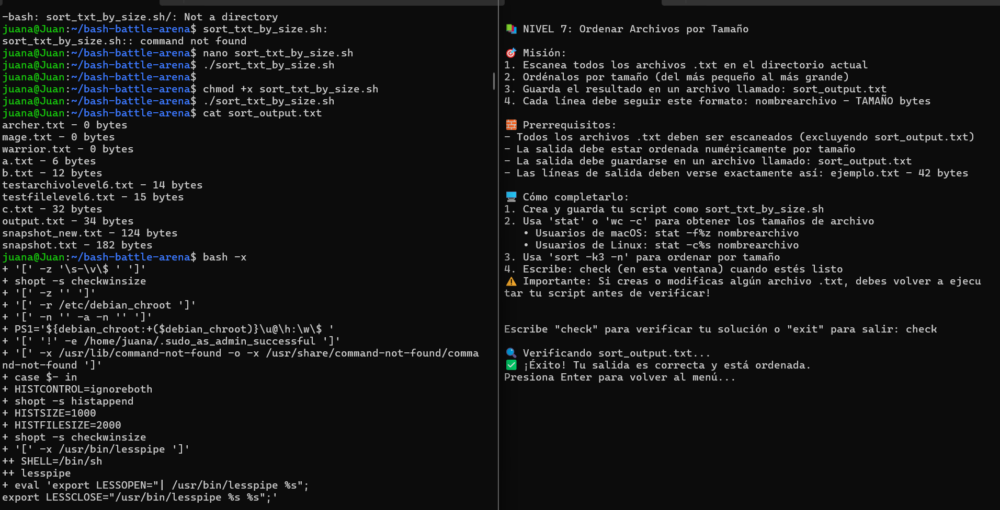
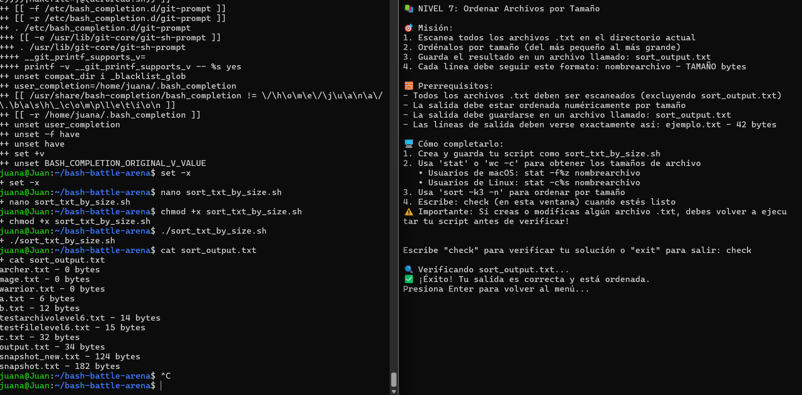
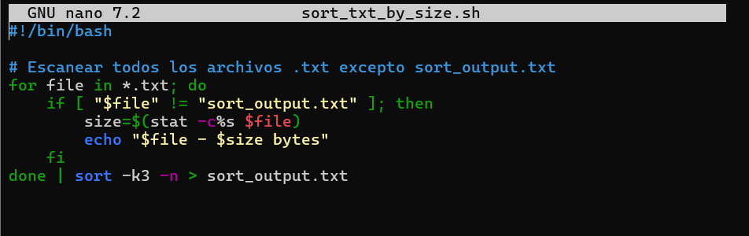

# nivel-07 - Bash Battle

## Archivos

## Descripción del proceso
En este nivel fui probando los scripts y corrigiendo errores que aparecieron.

## Reflexión
Aprendí a manejar archivos, argumentos y errores paso a paso.

_Actualizado automáticamente el 08-11-2025 a las 10:01:46._
